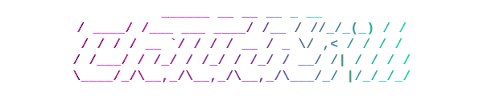

<div align="center">



### <code>THE SURGICAL CACHE CLEANER</code>

[](https://opensource.org/licenses/MIT)
[](https://crates.io/crates/claudekill)
[](https://github.com/olbboy/claudekill/actions)

<br/>

> **OBLITERATE NOISE. RECLAIM SPACE.**
>
> <code>ClaudeKill</code> is a high-velocity, terminal-native instrument designed to hunt down and neutralize `.claude` cache directories.

[FEATURES](#-system-capabilities) • [INSTALL](#-deployment) • [USAGE](#-command-deck) • [DOCS](#-intelligence)

</div>

---

## ⚡️ SYSTEM CAPABILITIES

| | |
| :--- | :--- |
| **🚀 PARALLEL CORE** | Multi-threaded filesystem traversal engine (`jwalk`). Scans sectors in milliseconds. |
| **🛡️ FAILSAFE** | **Safe Mode active.** Targets are moved to Trash. Hard-delete is opt-in only. |
| **🕹️ TERMINAL UI** | Keyboard-driven interface. VIM-style navigation. Pure retro feel. |
| **🔮 X-RAY** | Real-time storage impact visualization. Know the cost before you purge. |

## 📦 DEPLOYMENT

### POSIX // MACOS

```bash
brew install olbboy/tap/claudekill
```

### RUST // CARGO

```bash
cargo install claudekill
# OR via Binstall
cargo binstall claudekill
```

### MANUAL // BINARY

1.  Access [**GITHUB RELEASES**](https://github.com/olbboy/claudekill/releases).
2.  Acquire target binary (`x86_64` / `aarch64`).
3.  Execute.

## 🎮 COMMAND DECK

Run `claudekill` to initialize the visual interface.

```bash
$ claudekill
```

### INTERFACE

```text
┌────────────────────────────────────────────────────────────┐
│  SCANNING SECTOR: /Users/neo                               │
│  [24 TARGETS FOUND]                                        │
│                                                            │
│  [ ] ~/Projects/matrix-sim/.claude            1.2 GB       │
│  [x] ~/Projects/legacy-zion/.claude           450 MB       │
│  [ ] ~/Downloads/construct-v1/.claude         120 MB       │
│                                                            │
│  TOTAL SELECTED: 450 MB                                    │
└────────────────────────────────────────────────────────────┘
   ↑/↓: NAVIGATE  •  SPACE: TOGGLE  •  d: EXECUTE TRASH
```

### CLI ARGS

| PARAMETER | EFFECT |
| :--- | :--- |
| `--path <DIR>` | **TARGET LOCK.** Scan specific sector only. |
| `--dry-run` | **RECON.** List targets; no UI engagement. |
| `--include-global` | **OVERRIDE.** Scan `~/.claude` global cache. |
| `--permanent` | **INCINERATE.** Bypass Trash. **NO UNDO.** |

### KEYBINDINGS

| INPUT | ACTION |
| :--- | :--- |
| `k` / `↑` | **UP** |
| `j` / `↓` | **DOWN** |
| `SPACE` | **MARK TARGET** |
| `a` | **MARK ALL** |
| `d` | **EXECUTE** |
| `q` | **ABORT** |

## 📚 INTELLIGENCE

- **[MISSION BRIEF](docs/project-overview-pdr.md)** // PROJECT GOALS
- **[SCHEMATICS](docs/system-architecture.md)** // ARCHITECTURE
- **[PROTOCOLS](docs/deployment-guide.md)** // RELEASE GUIDE

---

<div align="center">
  <sub>MIT LICENSE // EST. 2024 // OPEN SOURCE</sub>
</div>
